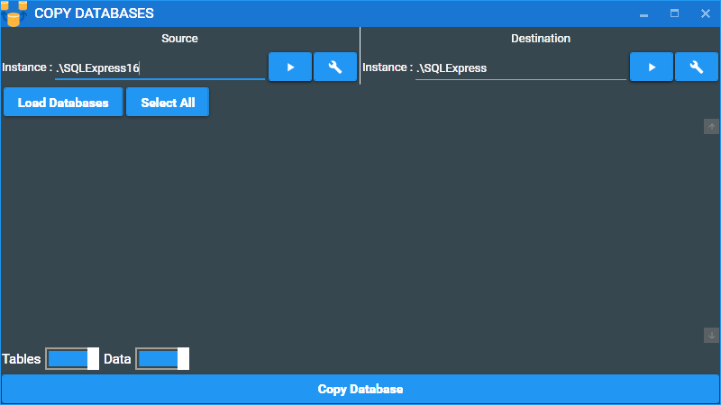
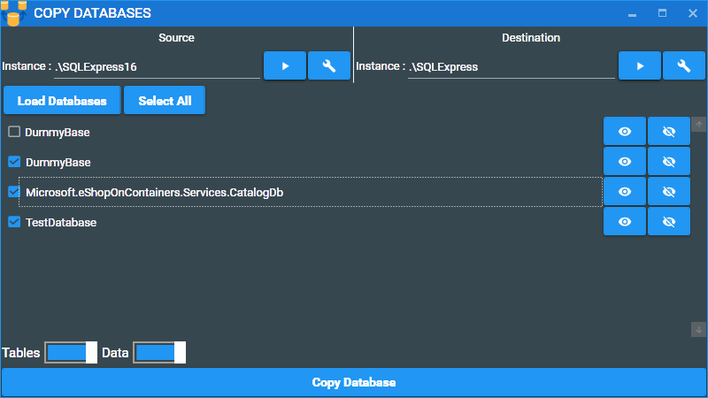
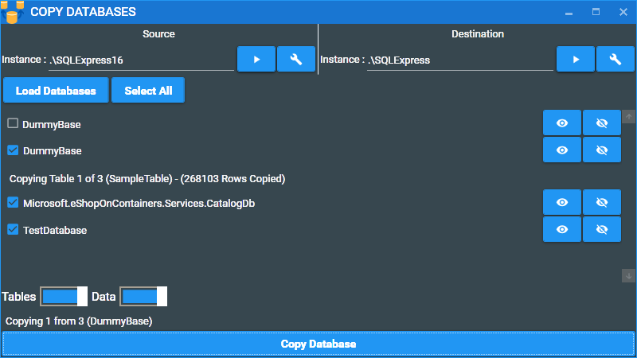

# Copy Database
A Simple Tool To Copy a Database from one MsSQL Server to Another

[ Get more details at **codescene.io**.](https://codescene.io/projects/5388/jobs/latest-successful/results)

## Download

This application uses Click once deployment packaging to install please use the following [CopyDatabase.application](https://github.com/Kimahari/CopyDatabase/releases/download/1.0.0.11/CopyDatabase.application)

Please note at the moment still trying to get a code signing certificate sorted so windows will display an untrusted publisher when running the application.

## Using the application

1) Once the application have been started you will see the following window.

* Source : Source Database Server where you whould like to copy one or more databases from
* Destination : Destination Database server where you whould like to copy one or more databases too.
* Load Databases : Loads the Databases from the source Database server
* Wrench Buttons : Advanced Configuration for the Database server sources (User name passwords)

2) Once The databases have been loaded the user will have access to select one or more database to copy from one source to another.

3) To initialize the copy process click the copy database command at the bottom of the screen **Note** - The databases in the destination server gets dropped once the copy process is started *Please ensure to backup all destination databases before hand...*.

# Known Issues

1) Application Crash when Load database is clicked with one or more unconfigured / invalid server sources
2) Copy Database button is not disabled when copy start.
3) Stored proceduces and views fail to copy over when there are references to tables that do not exists (need a continue on failure for these scenarios) .
