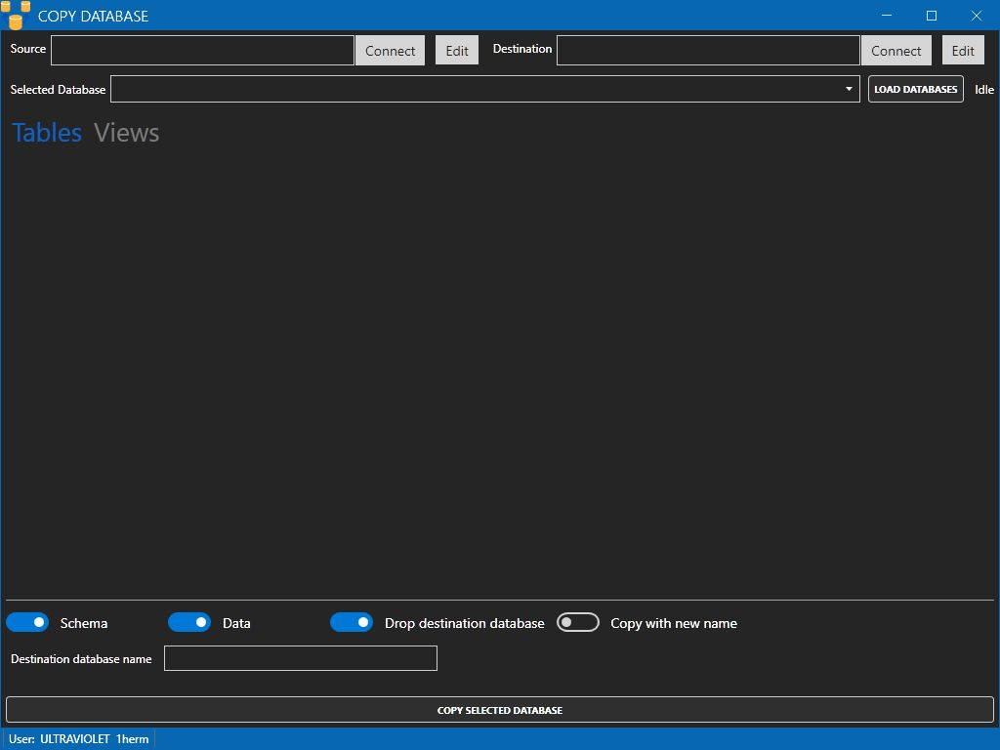
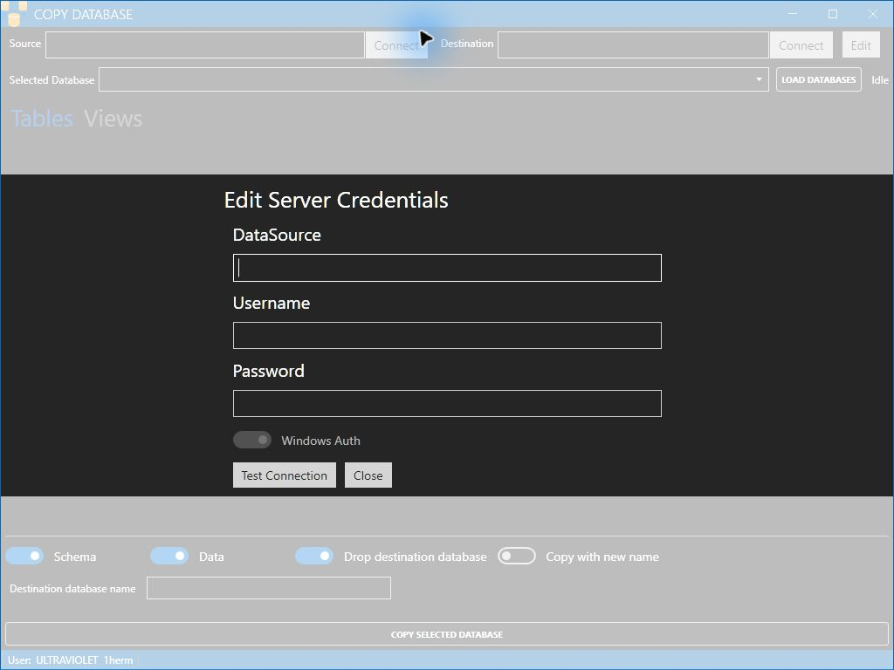
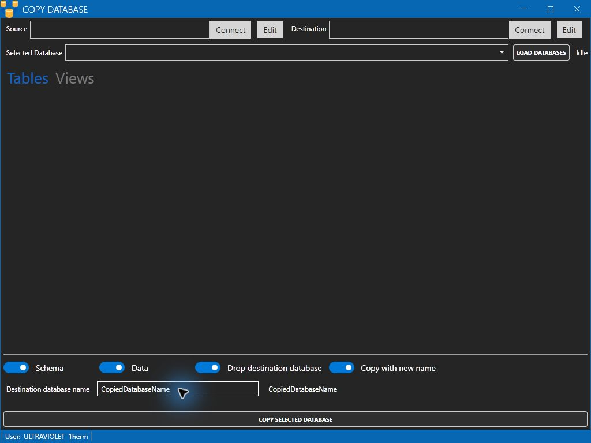

# Copy Database

A Windows desktop tool for copying one or more Microsoft SQL Server databases from a source server to a destination server.

[ Get more details at **codescene.io**.](https://codescene.io/projects/5388/jobs/latest-successful/results)

## Download

Copy Database is published with ClickOnce. Download the current installer from the repository publish folder:

[Publish folder](https://github.com/Kimahari/CopyDatabase/tree/master/Publish) | [CopyDatabase.application](https://github.com/Kimahari/CopyDatabase/blob/master/Publish/CopyDatabase.application)

The ClickOnce application artifacts are prepared in `Publish/` so they can be reviewed and signed through the SignPath Foundation process before release. Signing is provided by the SignPath Foundation; do not publish unsigned release artifacts as the final public installer.

## Publishing

Use the `ClickOnceProfile` publish profile from Visual Studio or MSBuild. The profile publishes to the repository-local `Publish/` folder and configures the install URL for the GitHub-hosted publish artifacts.

After publishing, send the generated ClickOnce artifacts through SignPath Foundation for code signing, then commit the signed `Publish/` output.

## Using the Application

When the application starts, enter or edit the source and destination SQL Server connection details, then connect to each server.

The server credential editor supports SQL credentials or Windows authentication.

After connecting, load the source databases, choose a source database, select the tables or views to copy, and configure the copy options. The current workflow supports copying schema, copying data, dropping the destination database before copy, and copying into a new destination database name.

Use **Copy Selected Database** to start the copy process. If **Drop destination database** is enabled, the destination database is dropped before the copy starts. Back up destination databases before running a destructive copy.

## Known Issues

1. The application can still fail when loading databases from unconfigured or invalid server sources.
2. Copy progress and failure handling still need more resilient user feedback.
3. Stored procedures and views can fail to copy when they reference missing objects; the copy workflow still needs a continue-on-failure path for those scenarios.
